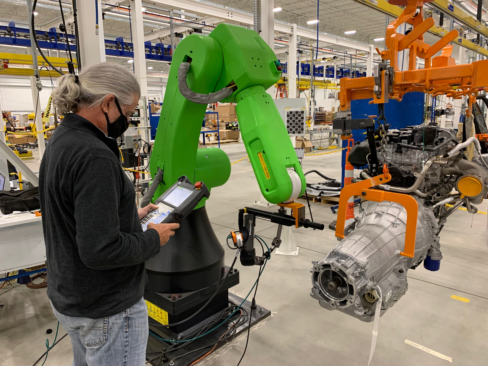
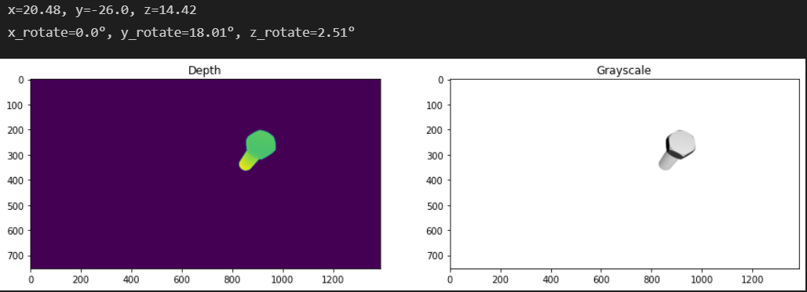
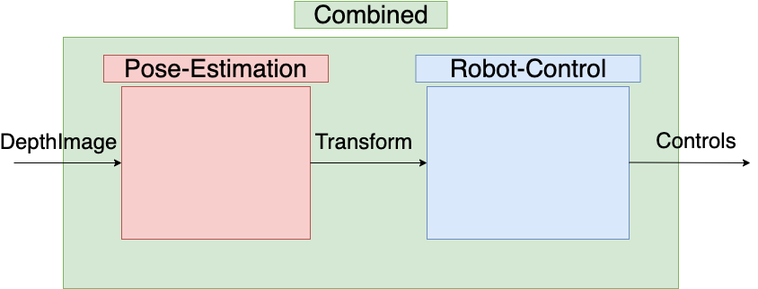

# Robotorque


### Introduction
Here at GM manafacturing IT, we love finding innovative ways to solve hard problems.
On the Vision as a Service (VaaS) Team, our specialty is computer vision and robotics.
Today, you have the chance to solve a real problem we are working on, called Robotorque.




### Problem Definition
The use case of Robotorque is to be able to screw bolts in on a moving fixture using a robot arm. At each timestep, we take a 3d picture of the fixture of interest using a lidar.
Our goal is to be able to use the depth image input to be able to control the robot to move to the bolt and screw it in. This problem could theoretically be solved in an end-to-end solution (perhaps using reinforcement learning). If you think you can do this, go right ahead! However, another common approach is to divide this problem into two parts. In one part, you try to estimate the pose (rotation and translation) of the bolt. In the other, you and assume you have the pose of the bolt and solve the robot control, then combine these solutions to get a full solution.

In the pose-estimation challenge, you will be given a depth image of a bolt that has been transformed. Your goal is to estimate the pose of that bolt based off the image.
In the robot-control challenge, we expose a simulator endpoint which streams bolt poses. On our backend, we are determining the transforms according to physical simulation models that are hidden to you. For each pose, you must return where you want the robot to go. Your goal is to keep the robot arm touching the face of the bolt. You are rewarded accordingly. The catch is this: your observation cadence is much less frequent than your control cadence.
That is, you must control the robot based off where you predict the bolt is at any time.

When you feel like you are ready, you can combine your solutions to pose challenge and robot challenge and submit to the combined challenge which now gives you depth images of the bolts and you have to control the robot off of (instead of the underlying pose of the bolt).


Here you can see a bolt that has been translated and rotated. Using a lidar camera, we can get both a grayscale image (sometimes called texture) and a depth cloud (that can be converted into a pointcloud). Given these images, would you be able to predict what the transform was? 


You can solve the combined challenge in one go. Or you can solve the pose-etimation challenge and robot-control challenge and them combine them to solve the combined challenge.

## How do I win?
There are 3 sub-challenges: pose-estimation, robot-control, and combined. The grand prize will go to the top scorer of the combined challenge. However, our runner up prizes will go the winners of pose-estimation and robot-control. We think it may be easiest to solve the pose and robot challenge independently first (you could split your team up and work on these in parallel) and then combine them to produce a solution to the combined challenge... but in the end, your workflow is up to you!

At any time during the competition, you are allowed to submit your solution to our backend and we will automatically grade you. You can query for the highscores for any of the three subchallenges and see where you stand. 

If your team is the top N scores (N TBD) at the end of the competition for a particular sub-challenge, your team will be asked to give a presentation to the GM judges.
The final prizes will be chosen according to the GM judges' discretion based on a
combination of final score and how much we like your solution. :)

## Resources
- [Tranformation Matrix](https://en.wikipedia.org/wiki/Transformation_matrix)
- [Video on transformation matrices](https://www.youtube.com/watch?v=vlb3P7arbkU&ab_channel=NorthwesternRobotics)
- [Right hand rule](https://en.wikipedia.org/wiki/Right-hand_rule)
- [Open3d](http://www.open3d.org/docs/release/introduction.html)
 

## How to get started
We have provided starter code along with a baseline solution to part 1 and part 2.
Please set the environment variable DISCORD_USERNAME before submitting your solution.
Please also have everyone on your team post in the *General Motors* discord channel that you are working on this challenge!!
We have written a baseline solution that will get you some results and enter you into the contest. You can then improve on this baseline!
Running through the sanity_check.py will submit the baseline solution under your username
and will enter you into the contest.

## Quick start
To get started locally, run the following on your local machine (assuming your have conda installed):
```
git clone https://github.com/josiahcoad/datathon-client
cd datathon-client
conda create -n gm-env python=3.8
conda activate gm-env
pip install -r requirements.txt
export DISCORD_USERNAME=<your discord username>
Download the pose data from shorturl.at/lrKL8 and put the two files in the datathon-client/images folder
python sanity_check.py
```
If you've gotten this far, you are ready to go and you've already made your first submission!
Head over to start_here.ipynb for a tutorial to get you started coding. 